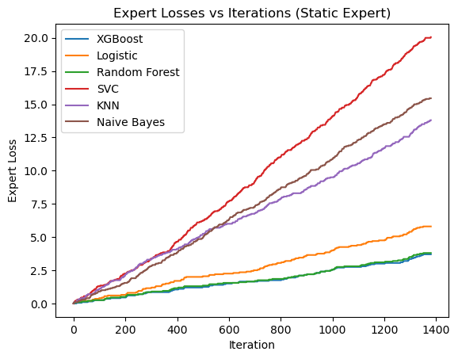
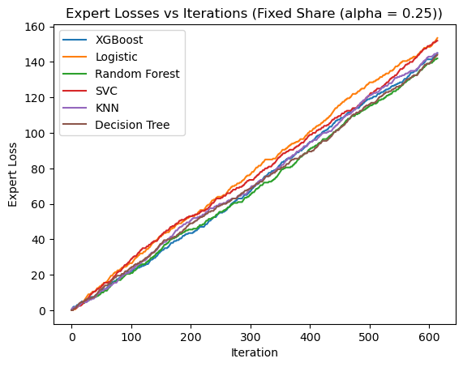

# Implementation of Static Expert and Fixed-Share (alpha) algorithms

This repository contains the implementation and analysis of Static Expert and Fixed-Share (alpha) algorithms, applied to the Cloud and Spambase data sets from the UCI Machine Learning Repository. The goal is to explore the performance of these algorithms by examining the evolution of expert weights, cumulative loss of the learner, and cumulative loss of the experts over iterations. The analysis aims to draw conclusions and provide observations based on the experimental results.

## Data Set

The Cloud and Spambase data sets can be downloaded from the UCI Machine Learning Repository at the following link: [UCI Repository](https://archive.ics.uci.edu/ml/datasets.php).

## Algorithms

### 1. Static Expert Algorithm

The Static Expert algorithm is one of the two algorithms implemented in this project. It is a simple yet effective approach and consists of a fixed number of experts, each designed to provide predictions for the given problem. These experts are pre-trained or pre-determined, and their predictions are combined to make the final decision. The algorithm does not update or adapt the expert weights based on the learning process.

### 2. Fixed-Share (alpha) Algorithm

The Fixed-Share (alpha) algorithm is the second algorithm implemented in this project. It is a dynamic ensemble learning method that assigns weights to each expert based on their individual performance. The Fixed-Share (alpha) algorithm combines the predictions of multiple experts by assigning weights to each expert's prediction. The weights are determined based on the experts' performance on previous iterations. The algorithm dynamically adapts the weights to give more importance to the better-performing experts and less importance to the underperforming ones.


## Expert Design

For both the Static Expert and Fixed-Share (alpha) algorithms, a total of six experts have been designed. The design of the experts is not specified, allowing for flexibility in the implementation. Each expert's prediction contributes to the collective decision-making process. The design and characteristics of these experts are flexible, allowing for different approaches and techniques to be used. The following are the descriptions of the six experts used:

1. **XGBoost Classifier**   

2. **Logistic Regression**

3. **Random Forest Classifier**

4. **Support Vector Classifier**

5. **KNN Classifier**

6. **Decision Tree Classifier** 


## Experimental Results

### Static_Experts:

<p align="center">
  
</p>


### Fixed_Share_alpha:

<p align="center">
  
</p>

The analysis of the algorithms involves studying the following aspects:

1. Evolution of expert weights with iterations: The weights assigned to each expert by the Fixed-Share (alpha) algorithm are tracked over the course of iterations. This provides insights into the algorithm's preference for certain experts based on their performance.

2. Cumulative loss of the learner versus iterations: The cumulative loss of the learner is calculated and monitored throughout the iterations. This measurement helps evaluate the learning progress and effectiveness of the algorithms.

3. Cumulative loss of the experts versus iterations: The cumulative loss of each individual expert is computed and observed over iterations. This analysis allows for a comparison of the performance of different experts.


## Usage

To reproduce the experiments and analyze the Cloud and Spambase data sets using the Static Expert and Fixed-Share (alpha) algorithms, follow these steps:

1. Download the Cloud and Spambase data sets from the UCI Repository.
2. Preprocess and prepare the data sets for the algorithms.
3. Implement the Static Expert and Fixed-Share (alpha) algorithms using any programming language or framework of your choice.
4. Execute the algorithms and collect the required data, including expert weights, cumulative loss of the learner, and cumulative loss of the experts.
5. Analyze the collected data to draw conclusions and observations regarding the algorithms' performance.

## Repository Structure

```
├── data/
│   ├── cloud_dataset.csv
│   └── spambase_dataset.csv
├── Cloud_Experts.ipynb
├── Spambase_Experts.ipynb
├── README.md
```

- The `data` directory contains the Cloud and Spambase data sets in CSV format.
- The `Cloud_Experts.ipynb` file provides a Jupyter Notebook with the experimental analysis on Cloud dataset.
- The `Spambase_Experts.ipynb` file provides a Jupyter Notebook with the experimental analysis on Spambase dataset.
- The `README.md` file contains information about the project, its purpose, and instructions for usage.
